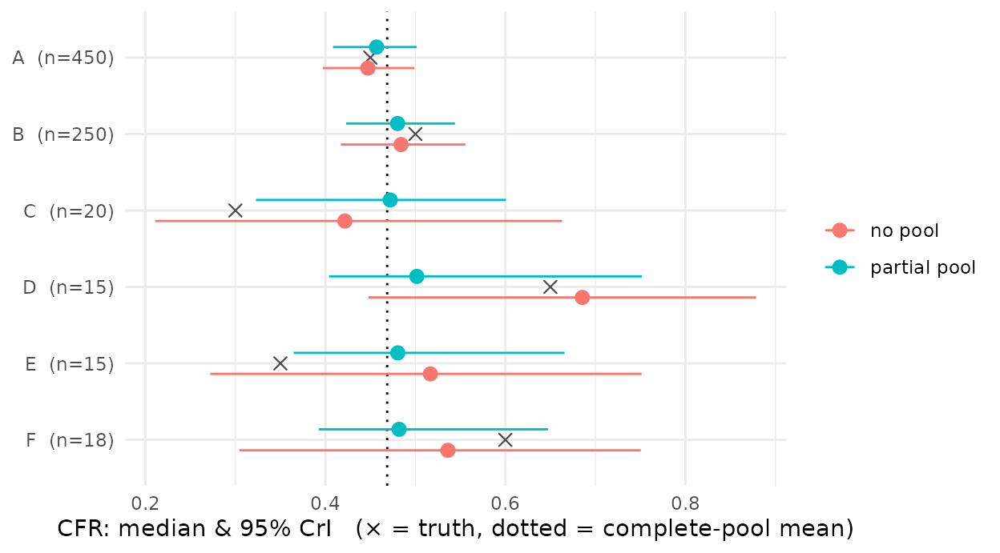
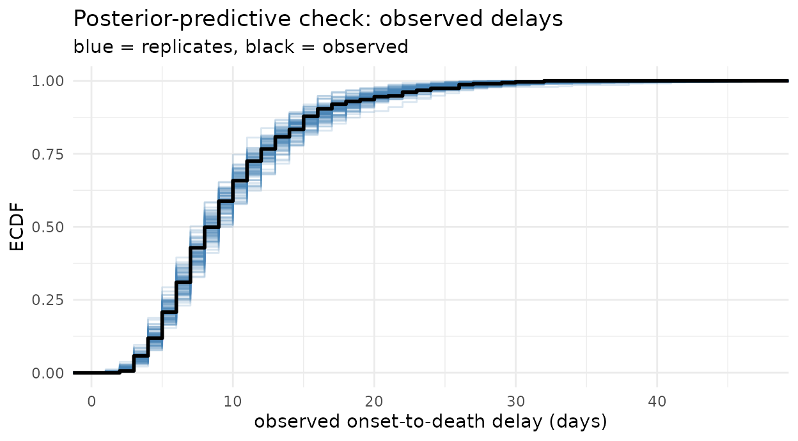

# Stratified and partially-pooled CFR

## Why stratify, and why pool

The CFR often varies by group – age, treatment centre, calendar period –
and a per-group estimate is frequently required. Two limiting cases
bracket the options. Fitting each group independently (*no pooling*)
gives high-variance estimates where a group’s sample is small. Fitting
one CFR for all groups (*complete pooling*) ignores between-group
variation.

*Partial pooling* lies between the two: each group’s CFR is drawn from a
common distribution, so groups with more data are estimated close to
independently while groups with less data are shrunk toward the shared
mean. `cfrnow` is an [epidist](https://epidist.epinowcast.org/) model,
so `prob` takes a `brms` formula and pooling is a one-line change:
`prob ~ (1 | group)`.

## A six-site line list

We simulate six treatment centres: two large (n = 450, 250) and four
small (n = 15–20), with true CFRs spread around a common mean. The large
sites pin the shared mean; the small ones carry little information on
their own, so shrinkage acts mainly on them. Site labels are synthetic.

``` r

library(cfrnow)
#> Loading required package: distspec
#> 
#> Attaching package: 'distspec'
#> The following objects are masked from 'package:stats':
#> 
#>     Gamma, sd
set.seed(20260714)

sites <- data.frame(
  site = c("A", "B", "C", "D", "E", "F"),
  n    = c(450, 250, 20, 15, 15, 18),
  cfr  = c(0.45, 0.50, 0.30, 0.65, 0.35, 0.60)
)

death_delay    <- LogNormal(mean = 11, sd = 6.5)
recovery_delay <- LogNormal(mean = 16, sd = 8)

ll <- do.call(rbind, Map(function(s, n, cfr) {
  cbind(
    simulate_linelist(
      n = n, cfr = cfr, delay = death_delay,
      recovery = recovery_delay, onset_days = 45
    ),
    site = s
  )
}, sites$site, sites$n, sites$cfr))

d <- prepare_cfr_data(ll, obs_time = as.Date("2026-02-20"), covariates = "site")
c(cases = d$n_cases, deaths = d$n_deaths)
#>  cases deaths 
#>    768    313
```

## Three fits: complete, no, and partial pooling

The only thing that changes across the three fits is the CFR formula;
the delay and recovery delay are co-estimated in each. (Two short chains
keep the build time short; use more for inference.)

``` r

otd <- LogNormal(meanlog = Normal(2.4, 0.2), sdlog = Normal(0.5, 0.15))
otr <- LogNormal(meanlog = Normal(2.7, 0.2), sdlog = Normal(0.5, 0.15))
args <- list(
  delay = otd, recovery_delay = otr, prob_prior = Beta(1, 1),
  backend = "cmdstanr", chains = 2, iter = 1000, refresh = 0, seed = 1
)

# complete pooling: a single CFR
fit_pool    <- do.call(fit_cfr, c(list(d, formula = brms::bf(mu ~ 1, prob ~ 1)), args))

# no pooling: an independent CFR per site (one estimated logit-CFR per site)
fit_sep     <- do.call(fit_cfr, c(list(d, formula = brms::bf(mu ~ 1, prob ~ 0 + site)), args))

# partial pooling: per-site CFR shrunk to a common mean
fit_partial <- do.call(fit_cfr, c(list(d, formula = brms::bf(mu ~ 1, prob ~ (1 | site))), args))
```

## Reading the estimates

For the complete-pool fit,
[`summary()`](https://rdrr.io/r/base/summary.html) reports a single
`prob` row:

``` r

summary(fit_pool)
#>        quantity       mean       q2.5        q50     q97.5      rhat ess_bulk
#> 1          prob  0.4681333  0.4267882  0.4686721  0.508917 1.0010756 813.3004
#> 2    delay_mean 10.8582476 10.0930085 10.8459693 11.742905 1.0013469 926.5919
#> 3      delay_sd  6.6874121  5.7020664  6.6560421  7.947957 0.9994687 907.4016
#> 4 recovery_mean 16.0502588 15.1570828 16.0374672 17.065176 1.0011242 980.8975
#> 5   recovery_sd  8.2562726  7.2671311  8.2214588  9.467139 1.0006297 912.5009
```

For a grouped fit it reports one `prob[<site>]` row per site:

``` r

summary(fit_sep)
#>         quantity       mean       q2.5        q50      q97.5      rhat ess_bulk
#> 1        prob[A]  0.4480522  0.3971325  0.4472548  0.4990700 1.0017035 1914.872
#> 2        prob[B]  0.4847888  0.4172538  0.4841065  0.5555488 0.9989003 1873.230
#> 3        prob[C]  0.4287040  0.2110529  0.4216512  0.6629198 1.0005887 1706.642
#> 4        prob[D]  0.6812513  0.4480224  0.6855231  0.8786456 0.9995608 1924.386
#> 5        prob[E]  0.5141535  0.2720657  0.5166827  0.7513390 0.9996392 1502.372
#> 6        prob[F]  0.5310520  0.3043325  0.5361800  0.7505137 0.9990898 2065.253
#> 7     delay_mean 10.8671009 10.0924490 10.8468784 11.8531386 0.9990550 1618.720
#> 8       delay_sd  6.7036343  5.6712944  6.6793767  7.9095963 0.9987743 1536.000
#> 9  recovery_mean 16.0667361 15.0689979 16.0460365 17.0854770 1.0004589 2393.782
#> 10   recovery_sd  8.2719518  7.3018037  8.2294945  9.4102772 1.0019774 1600.446
```

Collect those per-site CFR rows from the two grouped fits for the figure
below; the complete-pool fit supplies the shared mean.

``` r

cfr_rows <- function(fit, approach) {
  s <- summary(fit)
  r <- s[grepl("^prob\\[", s$quantity), ] # the prob[<site>] rows
  data.frame(
    approach = approach,
    site = sub("^prob\\[(.*)\\]$", "\\1", r$quantity),
    median = r$q50, lower = r$q2.5, upper = r$q97.5
  )
}

est <- rbind(cfr_rows(fit_sep, "no pool"), cfr_rows(fit_partial, "partial pool"))
est <- merge(est, sites[, c("site", "n", "cfr")], by = "site")
names(est)[names(est) == "cfr"] <- "truth"

s_pool <- summary(fit_pool)
pool_mean <- s_pool$q50[s_pool$quantity == "prob"]
```

## Shrinkage

Each site shows its no-pool and partial-pool estimate against the truth
(×) and the complete-pool mean (dotted). For the large sites (A, B) the
two estimates nearly coincide. For the small sites (C–F) the no-pool
interval is wide and the estimate noisy; partial pooling pulls it toward
the mean and narrows the interval sharply – lower variance at the cost
of some bias.

``` r

library(ggplot2)
est$approach <- factor(est$approach, levels = c("no pool", "partial pool"))
est$site <- factor(est$site, levels = rev(sites$site))

ggplot(est, aes(median, site, colour = approach)) +
  geom_vline(xintercept = pool_mean, linetype = 3) +
  geom_point(aes(x = truth), shape = 4, size = 2.4, colour = "grey30") +
  geom_pointrange(aes(xmin = lower, xmax = upper), position = position_dodge(width = 0.55)) +
  scale_y_discrete(labels = function(s) paste0(s, "  (n=", sites$n[match(s, sites$site)], ")")) +
  labs(
    x = "CFR: median & 95% CrI   (× = truth, dotted = complete-pool mean)",
    y = NULL, colour = NULL
  ) +
  theme_minimal()
```



## Varying the delay by group

A pooled onset-to-death delay that appears irregular is often a mixture
of several populations. If sites resolve on different timescales, pool
the delay by site as well, so each retains its own onset-to-death
distribution rather than contributing to a single multimodal one:

``` r

fit_both <- do.call(fit_cfr, c(
  list(d, formula = brms::bf(mu ~ (1 | site), prob ~ (1 | site))), args
))
```

## Check the fit

Check that the parametric delay reproduces the observed delays; the
real-time correction depends on extrapolating that delay’s tail.

``` r

pp_check_cfr(fit_partial, type = "delay")
```


